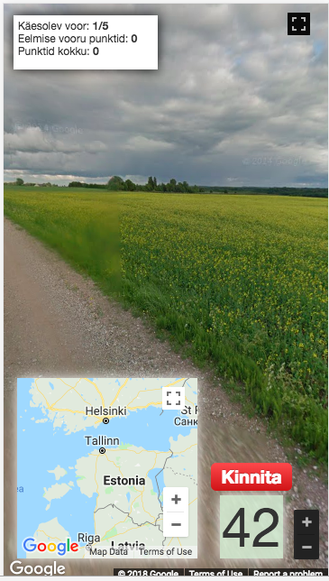
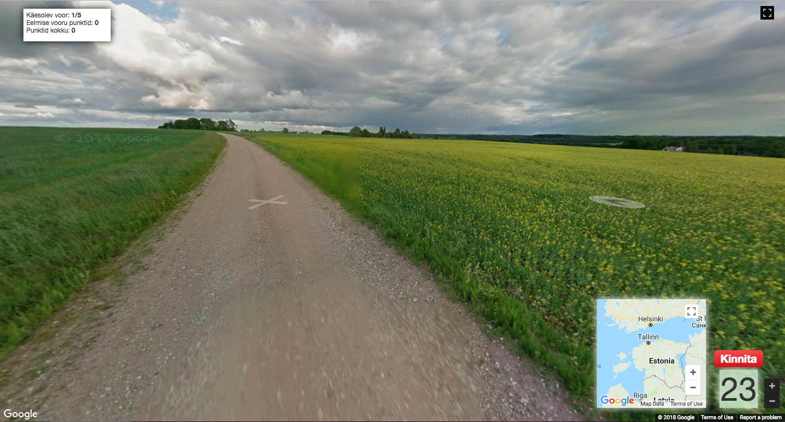

Maps Game
## KUSMAOLEN
Kas tunned Eestimaad? Leia võimalikult täpne asukoht kaardil.

### Autorid:
* *Julika Maiste*
* *Grete Ojavere*

### Mängu kirjeldus:

Mäng on loodud eesmärgiga tutvustada inimestele erinevaid kohti Eestimaal.

Selleks tuleb mängu alustades kohe hakata ümbrust uurima ja ära arvama, kus Eesti maakonnas ja veel täpsemaltki antud stardipunkt on. 

Aega on selleks 3 minutit, mis peaks oletuse tegemiseks olema piisav. 

Pakkumise tegemiseks klikka väikesel kaardil sobivasse kohta ja kinnita pakkumine. 

Täpsuse tagasiside tuleb kohe peale pakkumise kinnitamist. 

Kokku on mängus 5 vooru, millede lõppedes kuvatakse kogupunktide arv.
	
### Esialgne idee: 
*https://github.com/webdevbrian/whereami*

### Ekraanitõmmis rakendusest:

